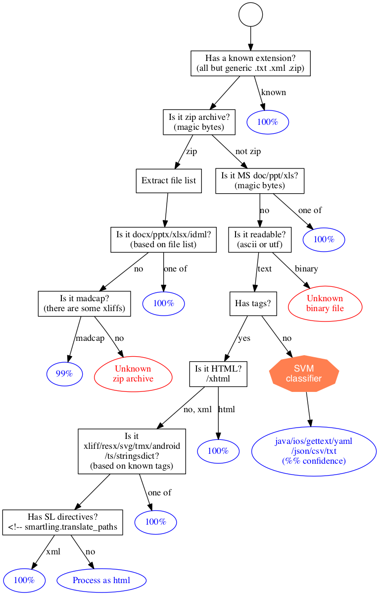

Smartling File Type Detector
============================


What is it
----------

**File Type Detector** service makes best effort to identify format of a file by

- known file extension
- analyzing file contents

[Supported file types are listed in the docs](http://docs.smartling.com/pages/supported-file-types/)

Identification of textual formats is based on [Smartling ml-text](https://github.com/Smartling/ml-text) library. 


Running
-------

The service is based on Spring Boot, see [spring boot gradle](http://docs.spring.io/spring-boot/docs/current/reference/html/build-tool-plugins-gradle-plugin.html).

Running in-place

```bash
./gradlew bootRun
```

API
---

### identify

`POST /v1/filetype/identify`

The method expects `multipart/form-data` file upload.

Example

```bash
curl -F "file=@example.lang" "https://api.smartling.com/v1/filetype/identify"
```

Response

```json
{"response":
  {"data":
    [
      {"name": "example.lang",
       "type": ["gettext","javaProperties","csv"],
       "confidence": [0.82,0.41,0.1],
       "referenceId": "a0b1c2d3"
      }
    ],
  "code": "SUCCESS",
  "messages": []
}}
```


SDK
---

The service comes with a [Java client](client)


Detection Logic
---------------

[](diagram.png)

Authors
-------

* [Pavel Ivashkov](https://github.com/paiv)


Copyright and license
---------------------

Copyright 2015 Smartling, Inc.

Licensed under the Apache License, Version 2.0 (the "License");
you may not use this work except in compliance with the License.
You may obtain a copy of the License in the LICENSE file, or at:

   http://www.apache.org/licenses/LICENSE-2.0

Unless required by applicable law or agreed to in writing, software
distributed under the License is distributed on an "AS IS" BASIS,
WITHOUT WARRANTIES OR CONDITIONS OF ANY KIND, either express or implied.
See the License for the specific language governing permissions and
limitations under the License.
